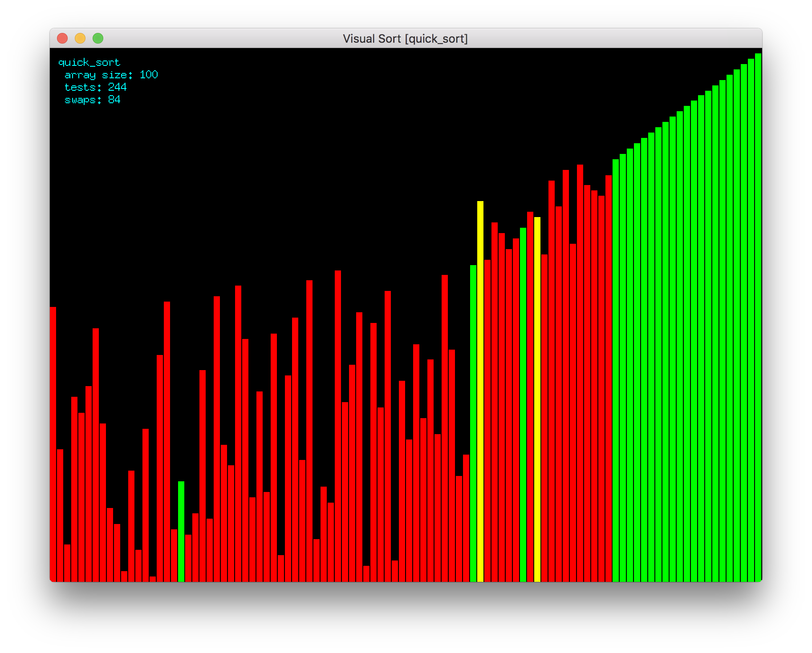

# Visualsort

Visualsort borns as a program to exploit the capabilities of pixel gaming library (and having fun with Go).

It's aim is to provide a visual representation of the most popular in-memory sorting algorithms.

## Screenshots



Demo video: <https://youtu.be/VOQb-9w5WS8>

## Algorightms

- [x] **Bubble Sort**
- [x] **Bubble Sort 2**: fast end
- [x] **Insertion Sort**
- [x] **Selection Sort**
- [x] **Shell Sort**
- [ ] **Cocktail Sort**
- [ ] **Merge Sort**

## Usage

Visualsort is a command line utility.

Just run `visualsort` to get a visual representation of quicksort (the default in-memory sorting algorithm for almost any standard library).

You can customize speed, delay, algorithm, data set and many more options for the sake of your experiments.

### Command Options

For a complete list of options issue the interactive help: `visualsort -h`.

Some of them are treated here:

- _asc_: will use a data set ordered in ascending
- _desc_: will use a data set prdered in descending
- _delay_: will retard the the start of the game by an amount of seconds. Useful for video recording
- _seed_: impose a random seed. Useful to compare algorithms with similar data sets.
- _size_: the size of the data set
- _speed_: the speed of the animation

## Installation

It would suffice

```
 go get github.com/MrBogomips/visualsort
```

## Contribution

This project started for fun to explore Go and Pixel gaming library.
The code should deserve better organization and a couple of algos, notably **Mergesort** are waiting for another weekend or… by yout contribution.

Neverthless… if you found another sorting algorithm to share…
